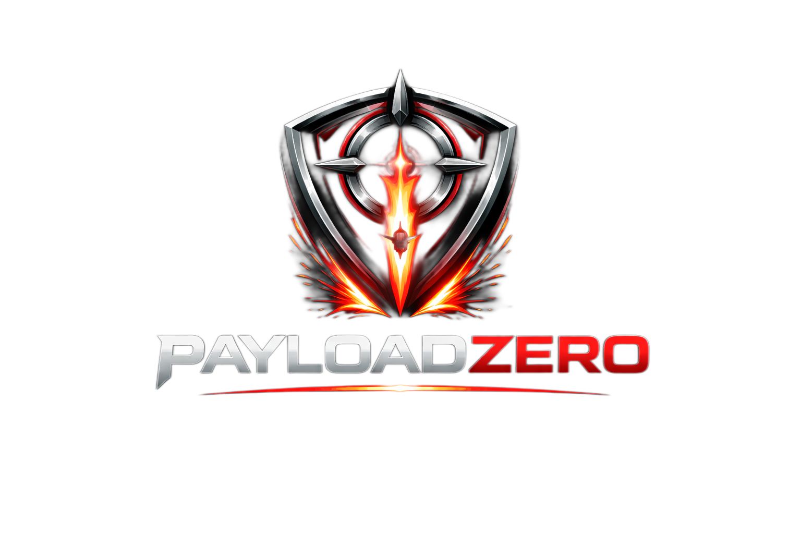

-------------------------------------------------------------------------------------------

# 🚨 PayloadZer0 - KEV Threat Scanner

[](https://opensource.org/licenses/MIT)
[](https://www.python.org/downloads/)
[](https://github.com/projectdiscovery/nuclei)

Automated threat intelligence scanner that monitors CISA's Known Exploited Vulnerabilities (KEV) catalog and scans your infrastructure for emerging threats using Nuclei templates.

## 🎯 What It Does

- **Continuous Monitoring**: Automatically checks CISA KEV catalog for new exploited CVEs
- **Smart Deduplication**: Only scans NEW vulnerabilities (no wasted resources)
- **Automated Scanning**: Finds and executes Nuclei templates for each CVE
- **Real-Time Alerts**: Microsoft Teams notifications for new CVEs and findings
- **Scalable**: Handles large target lists with rate limiting and parallelization
- **Comprehensive Logging**: Full audit trail of all scanning activity

Perfect for red teams, security operations, and vulnerability management programs.

## 🚀 Quick Start

### Prerequisites

- Python 3.8+
- [Nuclei](https://github.com/projectdiscovery/nuclei) vulnerability scanner
- Go 1.19+ (to install Nuclei)

### Installation

```bash
# 1. Clone the repository
git clone https://github.com/ob1sec/PayloadZer0.git
cd kev-threat-scanner

# 2. Run automated setup
chmod +x setup.sh
./setup.sh

# 3. Create your targets file
cat > hosts.txt << EOF
https://example.com
https://app.example.com
192.168.1.100
EOF

# 4. (Optional) Configure Teams notifications
export TEAMS_WEBHOOK_URL="https://outlook.office.com/webhook/YOUR_WEBHOOK"

# 5. Run your first scan
python3 payloadZer0.py -t hosts.txt --force-scan
```

## 📖 Usage

### Single Scan

```bash
# Scan for recent CVEs (last 30 days)
python3 payloadZer0.py -t hosts.txt --force-scan

# Scan for CVEs from last 90 days
python3 payloadZer0.py -t hosts.txt --force-scan --scan-recent-days 90
```

### Continuous Monitoring

```bash
# Check every hour for new CVEs
python3 payloadZer0.py -t hosts.txt --continuous --interval 3600

# Faster checks (every 30 minutes)
python3 payloadZer0.py -t hosts.txt --continuous --interval 1800
```

### Real-Time Dashboard

```bash
# View live monitoring dashboard
python3 monitor_dashboard.py --continuous

# Single snapshot
python3 monitor_dashboard.py
```

### Reporting & Analysis

```bash
# Generate comprehensive report
python3 kev_utils.py report

# Export findings to CSV
python3 kev_utils.py export -o findings.csv

# List vulnerable hosts
python3 kev_utils.py list-hosts

# Check specific CVE
python3 kev_utils.py check-cve CVE-2024-1234

# Search for CVEs by keyword
python3 kev_utils.py search "microsoft exchange"
```

## 🔔 Notification Types

### 🚨 New CVE Alert (Red)
Triggered when new CVEs are added to CISA KEV catalog
- CVE count and list
- Automatically initiates scan

### ▶️ Scan Started (Orange)
Triggered when vulnerability scan begins
- Number of CVEs being scanned
- Target host count

### 💥 Critical Findings (Red)
Triggered immediately when vulnerable hosts are found
- CVE details
- List of vulnerable hosts
- Sample of affected systems

### ✅ Scan Complete (Green/Red)
Triggered when scan finishes
- Total duration
- Summary of findings by CVE
- Top vulnerabilities discovered

## ⚙️ Configuration

### Command Line Options

```bash
python3 payloadZer0.py \
  -t hosts.txt \                      # Target file (required)
  --continuous \                      # Continuous monitoring mode
  --interval 3600 \                   # Check interval (seconds)
  --scan-recent-days 30 \             # Scan CVEs from last N days
  --rate-limit 150 \                  # Nuclei rate limit (req/s)
  --scan-timeout 10 \                 # Per-host timeout (seconds)
  --output-dir ./results \            # Results directory
  --teams-webhook "https://..." \     # Teams webhook URL
  --no-notify-findings \              # Disable findings alerts
  --no-notify-scan-events             # Disable scan start/end alerts
```

### Environment Variables

```bash
# Teams webhook (recommended over CLI flag)
export TEAMS_WEBHOOK_URL="https://outlook.office.com/webhook/YOUR_URL"
```

## 📁 Output Structure

```
.
├── kev_database.json          # CVE tracking database
├── kev_scanner.log           # Detailed logs
├── hosts.txt                 # Your target list
└── scan_results/             # Per-CVE results
    ├── CVE_2024_1234_results.json
    ├── CVE_2024_5678_results.json
    └── ...
```

### Result Format

Each CVE gets its own JSON file with Nuclei output:

```json
{
  "template": "cves/2024/CVE-2024-1234.yaml",
  "template-id": "CVE-2024-1234",
  "info": {
    "name": "Vulnerability Name",
    "severity": "critical",
    "description": "Details..."
  },
  "host": "https://vulnerable.example.com",
  "matched-at": "https://vulnerable.example.com/admin",
  "timestamp": "2024-12-12T03:45:22Z"
}
```

## 🎯 Use Cases

### Red Team Operations
- Pre-engagement reconnaissance
- Initial access discovery
- Lateral movement identification
- Assumed breach scenarios

### Security Operations
- Continuous vulnerability monitoring
- Threat intelligence integration
- Patch prioritization
- Security posture tracking

### Vulnerability Management
- Automated KEV compliance checking
- Risk-based vulnerability assessment
- Remediation tracking
- Executive reporting

## 🛡️ Security Considerations

⚠️ **Important**: Always ensure you have proper authorization before scanning any systems.

**Best Practices:**
- Use appropriate rate limits to avoid DoS
- Run from authorized security testing networks
- Secure scan results (contain vulnerability data)
- Protect Teams webhook URLs
- Review logs regularly
- Validate findings before taking action

See [SECURITY.md](SECURITY.md) for complete security guidelines.

## 📊 Performance

### Recommended Settings

**Small Environment (< 100 hosts)**
```bash
--rate-limit 300 --scan-timeout 10 --interval 1800
```

**Medium Environment (100-1000 hosts)**
```bash
--rate-limit 150 --scan-timeout 15 --interval 3600
```

**Large Environment (> 1000 hosts)**
```bash
--rate-limit 100 --scan-timeout 20 --interval 7200
```

## 🚢 Production Deployment

### Systemd Service

```bash
# Install service
sudo cp kev-scanner.service /etc/systemd/system/
sudo systemctl daemon-reload
sudo systemctl enable kev-scanner
sudo systemctl start kev-scanner

# Check status
sudo systemctl status kev-scanner
sudo journalctl -u kev-scanner -f
```

### Docker (Coming Soon)

```bash
docker build -t kev-scanner .
docker run -d \
  -e TEAMS_WEBHOOK_URL="https://..." \
  -v $(pwd)/hosts.txt:/app/hosts.txt \
  -v $(pwd)/results:/app/scan_results \
  kev-scanner
```

## 🔧 Troubleshooting

### Nuclei Not Found
```bash
go install -v github.com/projectdiscovery/nuclei/v3/cmd/nuclei@latest
export PATH=$PATH:$HOME/go/bin
```

### No Templates Found
```bash
nuclei -update-templates
```

### Teams Notifications Not Working
```bash
# Test webhook
curl -X POST "$TEAMS_WEBHOOK_URL" \
  -H "Content-Type: application/json" \
  -d '{"text":"Test message"}'
```

### High False Positives
```bash
# Increase timeout for slow targets
python3 payloadZer0.py -t hosts.txt --scan-timeout 20
```

## 📚 Documentation

- [Quick Start Guide](QUICKSTART.md)
- [Deployment Guide](DEPLOYMENT.md)
- [Contributing](CONTRIBUTING.md)
- [Security Policy](SECURITY.md)

## 🤝 Contributing

Contributions are welcome! Please see [CONTRIBUTING.md](CONTRIBUTING.md) for guidelines.

Areas we'd love help with:
- Docker support
- Additional notification channels (Slack, Discord, Email)
- Web UI for results
- CI/CD improvements
- Documentation

## 📄 License

This project is licensed under the MIT License - see [LICENSE](LICENSE) file for details.

## ⚠️ Legal Disclaimer

This tool is for authorized security testing only. Unauthorized access to computer systems may violate local, state, national, or international laws. Users are solely responsible for ensuring they have proper authorization before scanning any systems.

## 🙏 Acknowledgments

- [ProjectDiscovery](https://github.com/projectdiscovery) for Nuclei
- [CISA](https://www.cisa.gov/) for the KEV catalog
- The security research community

## 📧 Contact

- Issues: [GitHub Issues](https://github.com/ob1sec/PayloadZer0/issues)
- Security: See [SECURITY.md](SECURITY.md)

## ⭐ Star History

If you find this tool useful, please consider giving it a star!

---

**Built for the security community** 🛡️

